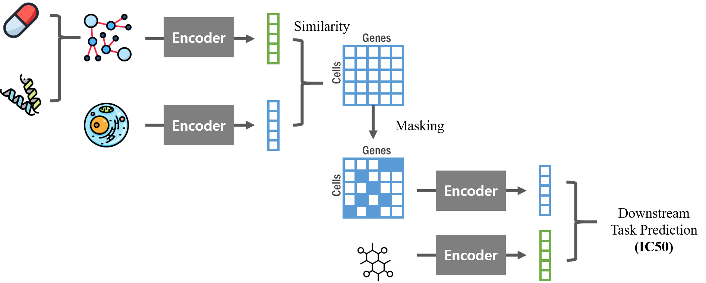

# DGDRP
GNN-based gene-selection deep learning model for drug response prediction

The use of drug and genomic data in drug response prediction poses a significant challenge due to the high number of genomic features. Coding genes alone often surpass 20,000, which can lead to overfitting and performance degradation due to the relatively small sample sizes in datasets. Existing studies attempt to mitigate this problem by reducing the number of genes under consideration. However, these strategies often overlook the unique biological mechanisms of each drug. A primary challenge arises from the lack of computational methods that can be computationally extract and represent information about a drug's biological mechanism.
In this paper, we propose a deep learning framework DGDRP (Drug-specific Gene selection for Drug Response Prediction) capable of adaptively performing gene selection specific to each drug, leveraging the drug target information. To extract the information of the downstream effects of a drug, a simulation module is employed using network propagation technique, drug target genes and protein-protein interaction network. Using the simulation result, a heterogeneous network comprising gene-level nodes and pathway-level nodes, is constructed for each drug. The biological mechanism of the drug can then be represented in a vectorized form by embedding the networks via graph neural network module. Next, to enable the selection of mechanism-related genes, a similarity score is calculated between the embedding of the network and the embedding of each gene. The genes are selected by masking the original gene expression data of each cell line based on the top \textit{k} similarity scores. Finally, the chemical fingerprints of the drugs and the masked gene expression profiles are fed into the predictor module and the drug response is predicted. As a result, DGDRP achieved the best performance when compared against five existing gene selection methods by a margin of 11\% in Pearson’s correlation coefficient. In addition, the investigation of the selected genes using pathway analysis demonstrated that the selected genes indeed enrich the pathways related to the biological mechanism of the drug. 
In conclusion, DGDRP in the context of drug response prediction can select genes related to the biological mechanism of a drug in an end-to-end fashion by exploiting drug target and protein-protein interaction information.



# Install
```
torch                     2.0.1+cu118
torch-geometric           2.3.1
torch-scatter             2.1.2
numpy                     1.25.2
pandas                    2.1.0
gseapy                    1.0.6
scikit-learn              1.3.0
scipy                     1.11.2
rdkit                     2023.3.3
```

# Data
 * __Drug data__: `Data/drug_data.pt`
 * __Cell line gene expression data__: `expression_10k_genes_data_total.pt`
     * Cell line gene expression data file is too large to upload to this repository. This file would be provided upon request to `alsdn9626@gmail.com`.
 * __Heterogeneous network__: `Data/template_adjacency_matrix_20_indirect_targets.tsv`
     * The STRING template network `9606.protein.links.symbols.v11.5.txt` is not uploaded due to its larg size.
(STRING template network can be obtained from [STRING_database](https://string-db.org/cgi/download?sessionId=bJ9NZpNP7Bn4&species_text=Homo+sapiens). The gene names have to be converted from ensembl IDs to gene symbols.)
 * __Drug response data__: `Data/response_data_total.tsv`

# Run
1. Construct heterogeneous network data
    ```
    python 01_heterogeneous_network_construction.py --workdir <DIR_PATH>/heteronet --n_indirect_targets 20
    ```

2. Make graph dataset
    ```
    python 02_construct_gnn_dataset.py --datadir <WORKDIR>/Data --n_indirect_targets 20 --data_type 20_indirect_targets
    ```

3. Train
    ```
    bash run_heteronet.sh
    ```

The results can be found in `./Results/` directory.

If you want to inspect genes selected by the model, pass a data batch to the `.get_mask()` method of the model which returns the mask that masks the gene expression profiles.  
The genes with the indices where 1s are located in the mask are the **selected genes**.